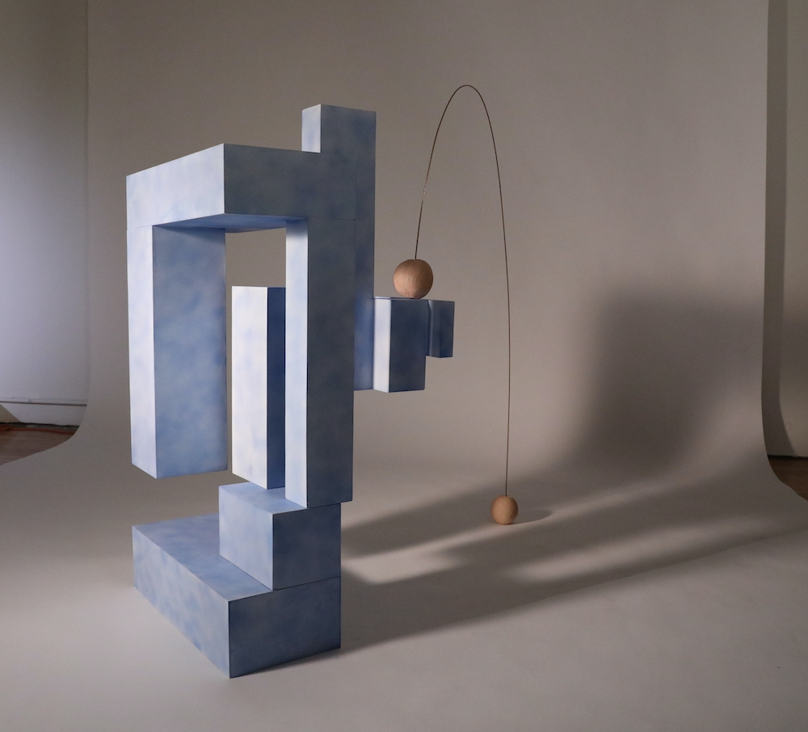

# hsim

## The idea

Create a system that can generate sculptures based on a set of constraints. Specifically, for the first incarnation of this project the constraints were set as follows:

  - The sculpture must be composed of volumes whose 3 dimensions belong to a predefined set.
  - The sculpture must be stable under the standard laws of physics on earth, even after tapping it.
  - The sculpture must be climbable by a cat.

## The implementation

We implement 3 systems:

  1. A randomized volume generator (custom system for splitting volumes based on ratio).
  2. A physics system (Used Nvidia PhysX).
  3. A motion planning system for the cat (parabolic motion planner borrowed from research papers).

We then perform thousands of simulations of randomized volumes until a volume passes all tests. For instance, we generate the volume, we then tap it from all sides to see if it falls over, and then we create a robot cat to see if it can jump to the top of the sculpture.

## Results

Realtime generative captures:

A built sculpture:

# Errata

Got this error on Xcode upgrade:
PhysX/physx/source/foundation/include/unix/PsUnixIntrinsics.h:59:2: error: implicit use of sequentially-consistent atomic may incur stronger memory barriers than necessary [-Werror,-Watomic-implicit-seq-cst]
        __sync_synchronize();
        ^~~~~~~~~~~~~~~~~~
1 error generated.

Had to do this modification
https://github.com/EmbarkStudios/physx-rs/issues/23
...
This can be fixed by modifying the physx-sys/PhysX/physx/source/compiler/cmake/mac/CMakeLists.txt and adding -Wno-atomic-implicit-seq-cst to the SET(PHYSX_CXX_FLAGS line.

